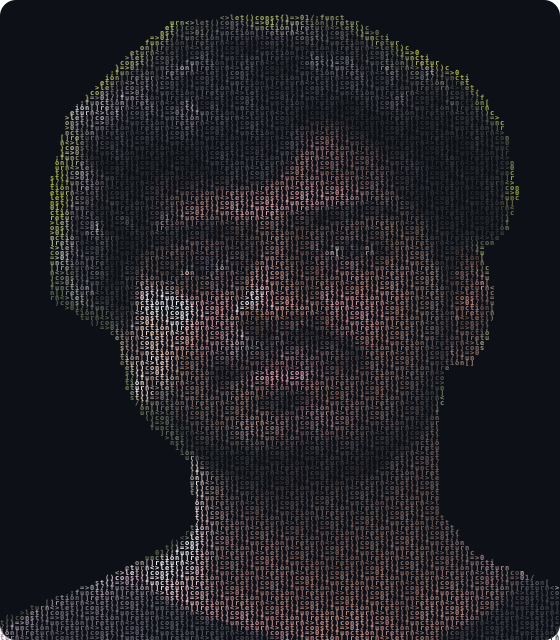

<div align="center">
  <a href="https://git.io/typing-svg">
    
  </a>
</div>

<br/>

<div align="center">
  
  &nbsp;
  <a href="https://www.linkedin.com/in/thamilnilavan">
    
  </a>
  &nbsp;
  <a href="mailto:Pavasuthan2002@gmail.com">
    
  </a>
  &nbsp;
  <a href="https://thamilnilavan.vercel.app/">
    
  </a>
  &nbsp;
  <a href="https://github.com/Thamilnilavan">
    
  </a>
</div>

---

## 🧑‍💻 About Me



```typescript
const thamilnilavan = {
  name        : "Uthayarasa Thamilnilavan",
  location    : "Kilinochchi, Sri Lanka 🇱🇰",
  role        : "Full-Stack Developer & AI/ML Engineer",
  education   : "BSc (Hons) Software Engineering @ Cardiff Met / ICBT",
  internship  : "Software Engineering Intern @ Vital Masks (6 months)",
  stack       : ["Next.js", "React.js", "Node.js", "Express.js", "MongoDB",
                 "TypeScript", "Python", "Flask", "TensorFlow"],
  aiml        : ["TensorFlow", "Keras", "OpenCV", "MediaPipe", "XGBoost",
                 "Scikit-Learn", "Pandas", "NumPy"],
  databases   : ["MongoDB Atlas", "MySQL", "SQLite"],
  currentlyLearning : ["Docker", "AWS / GCP", "LLM Integration"],
  highlight   : "EmoLearn — 85%+ accuracy emotion-aware AI learning platform 🧠",
  motto       : () => "Ship clean code. Scale smart. Keep learning. 🚀"
};
```

<br clear="right"/>

---

## 🛠️ Tech Stack

### 💬 Languages


### ⚙️ Frameworks & Libraries


### 🤖 AI / ML


### 🗄️ Databases


### 🔧 Tools & Platforms


### 🧩 Concepts & Methods


### ☁️ Currently Learning


---

## 📊 GitHub Stats

<div align="center">
  <a href="https://github.com/Thamilnilavan">
    
  </a>
  <a href="https://github.com/Thamilnilavan">
    
  </a>
</div>

---

## 🔥 GitHub Streak

<div align="center">
  
</div>

---

## 🐍 Contribution Snake

<div align="center">
  <picture>
    <source media="(prefers-color-scheme: dark)" srcset="https://raw.githubusercontent.com/Thamilnilavan/Thamilnilavan/output/github-contribution-grid-snake-dark.svg"/>
    <source media="(prefers-color-scheme: light)" srcset="https://raw.githubusercontent.com/Thamilnilavan/Thamilnilavan/output/github-contribution-grid-snake.svg"/>
    
  </picture>
</div>

---

## 🏆 Trophy Wall

<div align="center">
  
</div>

---

## 💼 Professional Experience

<details>
<summary><b>🏢 Vital Masks — Software Engineering Intern &nbsp;|&nbsp; May 2026 – Oct 2026 &nbsp;|&nbsp; Sri Lanka</b></summary>

<br/>

> 
> 
> 
> 
> 
> 
> 

- Contributed to a **production POS system** as part of a 4-intern Agile team, delivering **7+ modules** covering products, inventory, barcode scanning, customers, suppliers, returns, and reporting.
- Built and integrated **responsive, reusable frontend components** in React.js and Next.js; collaborated on RESTful backend API integration and MongoDB-driven features.
- Participated in **daily stand-ups, sprint planning, and peer code reviews** via GitHub pull requests, maintaining clean version-controlled codebases.
- Gained end-to-end exposure to a **commercial full-stack product lifecycle** — requirements → development → testing → deployment in a live business environment.

</details>

---

## 🚀 Featured Projects

<div align="center">

| 🚀 Project | 🛠️ Stack | ✨ Highlights |
|:---|:---|:---|
| **EmoLearn — AI Learning Platform** *(BSc FYP)* | Next.js · TypeScript · Node.js · Express.js · MongoDB · Python · Flask · TensorFlow · Keras · OpenCV · MediaPipe | **85%+ emotion recognition accuracy** · Detects 7 emotion states in real-time · Multi-role system (Student/Teacher/Admin) · Flask ML microservice · Adaptive content delivery · Full CI/CD pipeline |
| **F1 Pit Stop Prediction** *(ML Project)* | Python · Pandas · NumPy · Scikit-Learn · XGBoost · DNN · Kaggle | **98% accuracy with XGBoost** · 50,000+ data points · 6 algorithms benchmarked · Precision/Recall/AUC-ROC evaluation · Hyperparameter tuning & cross-validation |
| [**ThinkSync — Student Community**](https://github.com/Thamilnilavan/Thamilnilavan_profile) | React.js · Node.js · Express.js · MongoDB · Socket.IO · JWT · Vercel | **200+ concurrent users** · <100ms message latency · 35% load time reduction · JWT + RBAC auth · Vercel deployed |
| **FitZone Fitness Center** | HTML5 · CSS3 · JavaScript · PHP · MySQL | **98/100 Lighthouse mobile score** · MVC architecture · Admin dashboard · Secure session auth |
| **LuxeVista Resort App** | Java · Android Studio · SQLite | **500+ SQLite records** · 8+ screens · 4.5/5 usability rating · Material Design · Offline-capable |

</div>

---

## 🎓 Education

<div align="center">

| 🎓 Degree | 🏫 Institution | 📅 Year |
|:---|:---|:---|
| BSc (Hons) Software Engineering | Cardiff Metropolitan University via ICBT Campus, Jaffna | 2025 – Present |
| Higher Diploma in Software Engineering | ICBT Campus, Jaffna | 2024 – 2025 |
| G.C.E. Advanced Level | Kn/Kilinochchi Madya Maha Vidyalaya | 2016 – 2022 |

</div>

> 📖 **Relevant coursework:** AI/ML · Computer Vision · Data Structures & Algorithms · Web Technologies · Database Management · OOP · Software Engineering Principles

---

## 📚 Currently Learning

```
🐳 Docker         →  Containerisation, Docker Compose, image optimisation
☁️  AWS / GCP      →  EC2, S3, Cloud Functions, deployment pipelines
⚡  CI/CD          →  Advanced GitHub Actions, automated testing workflows
🤖 LLM Integration →  Prompt engineering, LangChain, AI-powered app design
```

---

## 🌐 Languages

| Language | Level |
|:---|:---|
| Tamil | Native |
| English | B2 – IELTS 5.5 |

---

## 🤝 Connect with Me

<div align="center">
  <a href="https://www.linkedin.com/in/thamilnilavan">
    
  </a>
  &nbsp;
  <a href="mailto:Pavasuthan2002@gmail.com">
    
  </a>
  &nbsp;
  <a href="https://thamilnilavan.vercel.app/">
    
  </a>
</div>

<br/>


